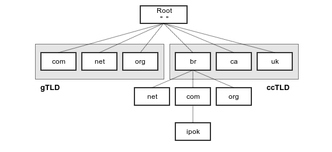

# DNS 

## :small_orange_diamond: Sobre 

Tem a função de transformar nome em IP

  

### :small_orange_diamond: TLD (Top Level Domain))
 TLD é o último segmento de um nome de domínio, o qual surge depois do ponto final. Exemplos:

GTLD: .com, .edu, .org, etc
CCTL: .br, .us, etc

### :small_orange_diamond: Fluxo de Requisição DNS: 

  
