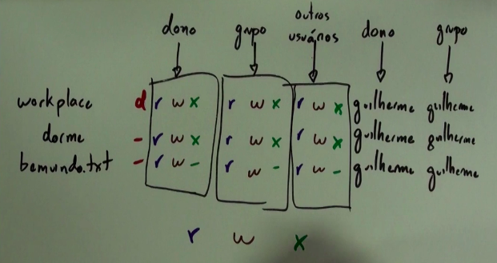

# Bash

Ler script: 

```
sh nome_do_script
```

# Permissões 

#### As permissões se dividem em: 

1. r = permissão para leitura
2. w = permissão para escrita
3. x = permissão para execução 

#### Para checar as permições de diretório ou arquivo basta executar o comando `ls -l` e ele retormará uma lista tipo essa: 

<p align="center">  </p>

#### As permissões são lidas assim: 

<p align="center">  </p>

### :small_orange_diamond: Mudar permissões:

```
chmod +x arquivo_ou_diretório
```
> aqui estou adicionando o X para dar acesso a abrir e executar este arquivo
