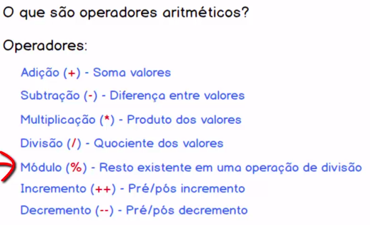
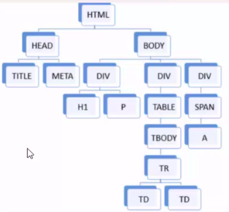

# JavaScript

## Sobre

Aprendendo Javascript novamente para ter uma base nos estudos de Vue.js.

[Doc](https://www.w3schools.com/js/default.asp)
### :small_orange_diamond: Entrada de dados:

```javascript
var nomeDaVar = prompt('Digite algo: ')
```

### :small_orange_diamond: Concatenação de strings

```javascript
'string ' + variavel + ' string'
```

### :small_orange_diamond: Variavel nula e undefined:

```javascript
var vaariavel = null #intencionalmente vazia

var variavel = undefined #aponta para valor inexistente
```
### :small_orange_diamond:  Array:

```javascript
var a = Array() -declarando
var a = [] -declarando
```
### :small_orange_diamond:  Array multidimensional(matriz):

```javascript
var a = Array()
a['frutas'] = Array() - declarando
a['frutas'] = [] - declarando
a['frutas'][0] = 'banana'
```

### :small_orange_diamond: Operadores de comparação e logicos:

```javascript
== - iguais
=== -iguais mesmo tipo
!== - diferentes e tipos diferentes
|| - ou
&& - E
```
### :small_orange_diamond: Operadores aritméticos:

<p align="center">  </p>

> Há também como incrementar variaveis com: '`+=`' ou '`-=`'
### :small_orange_diamond: Casting:

```javascript
parseInt(variavel)
variavel.toString()
```
### :small_orange_diamond: If/else:

```javascript
if (condição){

}else if{

}else{

}
```

### :small_orange_diamond: Operador ternário:

```javascript
var resultado = (condição) ? verdadeiro : falso 
```

### :small_orange_diamond: Switch:

```javascript
switch(variavel){
    case n:
        //
        break
    case m:
        //
        break
    default:
        //
        break
}
```

### :small_orange_diamond: Funções(metodos):

```javascript
    function nomeDaFuncao(var,var2){
        var result = var * var2
        return result
    }
    document.write(nomeDaFuncao(10, 5))
```
> Se forem passados mais parametros do que a função espera o Javascript descarta os parametros a mais e não quebra. E com parametros a menos ele traz undefined em um dos parametros.

### :small_orange_diamond: Funções Callback:

```javascript
function funcao(nomeDaFuncaoCallback){
            
        }
        
        var nomeDaFuncaoCallback = function(){
            ...
        }

        funcao(nomeDaFuncaoCallback)
```
> São funções sem retorno que podem ser enviadas por parametro em outras funções.

### :small_orange_diamond: Escopo:

1. Global - acessada em qualuqer lugar do código
2. Função - acessada apenas dentro da função em que foi criada
3. Bloco - acessada dentro de blocos como por exemplo: if, else, switch, etc

### :small_orange_diamond: Metodos de string:

```javascript
.length - retorna tamanho da string
.indexOf('a') - retorna indice da letra 'a' 
.replace('a', 'e') -substitui letra 'a' por 'e' 
.substr('charInicial', 'quantasChars') - recorta parte da string
.trim() - remove espaços nas extremidades
```

### :small_orange_diamond: Metodos de numeros:

```javascript
.random() - numero aleatório
```

### :small_orange_diamond: Metodos de datas:

```javascript
new.Date() - instancia
.getDate(variavelDate) - retorna data 
.getMonth() + 1 - retorna mês
.getFullYear()
```

## :small_orange_diamond: Eventos:

### :small_orange_diamond: Eventos de mouse:

```javascript
onclick - acionado quando elemento é clicado
ondblclick - acionado quando elemento é clicado 2 vezes
onmouseup - acionado quando click em um elemento é liberado
onmouseover - acionado quando cursor do mouse sobrepõe um elemento 
onmouseout - acionado quando cursor do mouse sai da região da pagina do elemento 
```

### :small_orange_diamond: Eventos de teclado:

```javascript
onkeydown - acionado quando teclo
onkeypress - acionado quando libera teclar (somente caracter)
onkeyup - acionado enquanto a tecla está acionada
```

### :small_orange_diamond: Eventos de janela:

```javascript
onresize - acionado quando pagina é redimencionada
onscroll - acionado quando scoll do mouse é acionado
```
### :small_orange_diamond: Eventos de formulario:

```javascript
onfocus - acionado quando elemento recebe foco do cursor
ondblur - acionado quando elemento perbe o foco do cursor
onchance - acionado quando estado do elemento é alterado
```

## :small_orange_diamond: DOM:

Arvore DOM 
<p align="center">  </p>


### :small_orange_diamond: Selecionar elementos DOM:

```javascript
.getElementById('id')
.getElementById('id').value - recupera o valor do elemento
.getElementById('id').className - modifica classe do elemento
.getElementsByTagName()
.getElementsByClassName()
.getElementsByName()
```